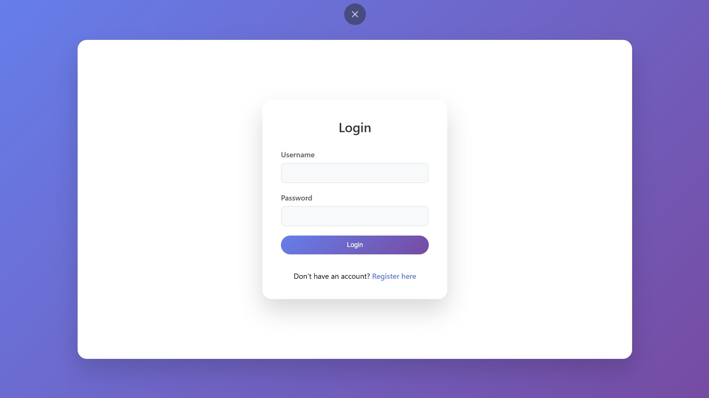
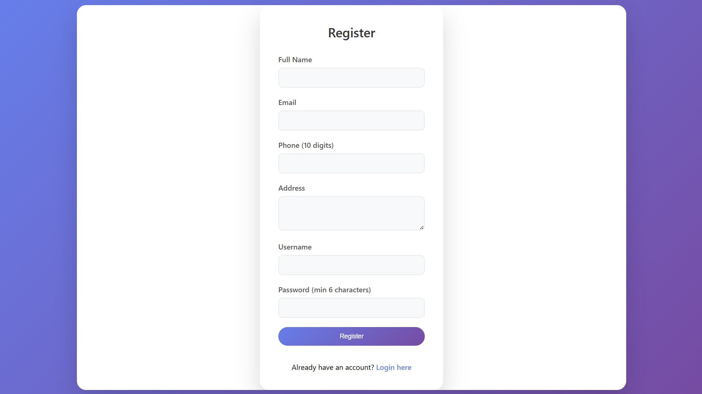

# FinTech Customer & Loan Management System

A comprehensive Spring Boot application for managing customer registrations and loan applications with role-based security.

## Tech Stack Used

- **Java 17** - Programming language
- **Spring Boot 3.2.0** - Application framework
- **Spring Data JPA** - Data persistence layer
- **Spring Security** - Authentication and authorization
- **JWT (JSON Web Token)** - Token-based authentication
- **MySQL 8.0** - Database
- **Hibernate** - ORM framework
- **Lombok** - Reduce boilerplate code
- **Maven** - Build tool
- **Bean Validation** - Input validation

## Project Structure

```
src/main/java/com/fintech/
├── config/
│   ├── DataInitializer.java
│   └── SecurityConfig.java
├── controller/
│   ├── AuthController.java
│   ├── CustomerController.java
│   └── LoanController.java
├── dto/
│   ├── ApiResponse.java
│   ├── CustomerRegistrationDto.java
│   ├── LoanApplicationDto.java
│   ├── LoanStatusUpdateDto.java
│   └── LoginDto.java
├── entity/
│   ├── Customer.java
│   ├── Loan.java
│   └── User.java
├── exception/
│   ├── GlobalExceptionHandler.java
│   ├── ResourceAlreadyExistsException.java
│   └── ResourceNotFoundException.java
├── repository/
│   ├── CustomerRepository.java
│   ├── LoanRepository.java
│   └── UserRepository.java
├── security/
│   ├── JwtAuthenticationEntryPoint.java
│   ├── JwtRequestFilter.java
│   └── JwtUtil.java
├── service/
│   ├── CustomerService.java
│   ├── LoanService.java
│   └── UserService.java
└── LoanManagementSystemApplication.java
```
## 📸 Screenshots

### 🔐 Login Page


### 📝 Register Page


### 🧾 Loan Application for Customer


### 📊 Loan History


### 🏠 Admin Landing Page


### 📋 Admin Dashboard

## Thought Process

### Entity Design
1. **User Entity**: Handles authentication with username, password, and roles (CUSTOMER/ADMIN)
2. **Customer Entity**: Stores customer-specific information with auto-generated credit score
3. **Loan Entity**: Manages loan applications with status tracking and audit fields

### Security Architecture
- JWT-based authentication for stateless security
- Role-based access control (RBAC) with two roles: CUSTOMER and ADMIN
- Method-level security using `@PreAuthorize` annotations
- Password encryption using BCrypt

### API Design
- RESTful endpoints following standard HTTP methods
- Consistent response structure using `ApiResponse<T>` wrapper
- Comprehensive input validation using Bean Validation
- Proper HTTP status codes for different scenarios

### Database Design
- Normalized database structure with proper foreign key relationships
- Audit fields (created_at, updated_at) for tracking changes
- Enum types for loan types and statuses for data consistency

## API Endpoints

### Authentication
- `POST /api/auth/login` - User login (returns JWT token)

### Customer Management
- `POST /api/customers/register` - Customer registration

### Loan Management
- `POST /api/loans/apply` - Apply for loan (CUSTOMER role)
- `GET /api/loans/my-loans` - Get customer's loans (CUSTOMER role)
- `GET /api/loans` - Get all loans (ADMIN role)
- `PUT /api/loans/{loanId}/status` - Approve/Reject loan (ADMIN role)
- `GET /api/loans/{loanId}` - Get loan details (ADMIN role)

## Setup Instructions

### Prerequisites
- Java 17 or higher
- Maven 3.6+
- MySQL 8.0+

### Database Setup
1. Install MySQL and create a database named `fintech_loan_db`
2. Update database credentials in `application.properties`

### Running the Application
1. Clone the repository
2. Navigate to project directory
3. Run: `mvn clean install`
4. Run: `mvn spring-boot:run`
5. Application will start on `http://localhost:8080`

### Default Admin Account
- **Username**: admin
- **Password**: admin123

## Sample API Usage

### 1. Register Customer
```bash
curl -X POST http://localhost:8080/api/customers/register \
  -H "Content-Type: application/json" \
  -d '{
    "name": "John Doe",
    "email": "john@example.com",
    "phone": "1234567890",
    "address": "123 Main St, City",
    "username": "johndoe",
    "password": "password123"
  }'
```

### 2. Login
```bash
curl -X POST http://localhost:8080/api/auth/login \
  -H "Content-Type: application/json" \
  -d '{
    "username": "johndoe",
    "password": "password123"
  }'
```

### 3. Apply for Loan
```bash
curl -X POST http://localhost:8080/api/loans/apply \
  -H "Content-Type: application/json" \
  -H "Authorization: Bearer YOUR_JWT_TOKEN" \
  -d '{
    "loanType": "PERSONAL",
    "amount": 50000,
    "remarks": "For home renovation"
  }'
```

### 4. Admin - View All Loans
```bash
curl -X GET http://localhost:8080/api/loans \
  -H "Authorization: Bearer ADMIN_JWT_TOKEN"
```

### 5. Admin - Approve/Reject Loan
```bash
curl -X PUT http://localhost:8080/api/loans/1/status \
  -H "Content-Type: application/json" \
  -H "Authorization: Bearer ADMIN_JWT_TOKEN" \
  -d '{
    "status": "APPROVED",
    "remarks": "All documents verified"
  }'
```

## Features Implemented

### Core Requirements
- ✅ Customer entity with auto-generated credit score
- ✅ Loan entity with types (Personal, Home, Car) and status tracking
- ✅ Customer registration API
- ✅ Loan application API
- ✅ View all loans API (Admin only)
- ✅ Approve/Reject loan API (Admin only)
- ✅ Input validation (amount > 0, email uniqueness)

### Additional Security Features
- ✅ JWT-based authentication
- ✅ Role-based access control
- ✅ Password encryption
- ✅ Method-level security
- ✅ Comprehensive exception handling

## Possible Improvements

### Short-term Enhancements
1. **Email Notifications**: Send email alerts for loan status updates
2. **Loan Eligibility Checks**: Implement credit score-based auto-approval rules
3. **File Upload**: Support document upload for loan applications
4. **Pagination**: Add pagination for loan listing APIs
5. **Search and Filtering**: Add search functionality for loans

### Long-term Enhancements
1. **Audit Logging**: Comprehensive audit trail for all operations
2. **Reporting Dashboard**: Analytics dashboard for loan statistics
3. **Multi-tenant Support**: Support for multiple financial institutions
4. **Integration APIs**: Third-party credit bureau integration
5. **Mobile App Support**: RESTful APIs optimized for mobile consumption
6. **Notification System**: Real-time notifications using WebSocket
7. **Document Management**: OCR and document verification system

### Performance Improvements
1. **Caching**: Redis cache for frequently accessed data
2. **Database Optimization**: Query optimization and indexing
3. **API Rate Limiting**: Prevent API abuse
4. **Monitoring**: Application performance monitoring with Micrometer

## Challenges Faced

### 1. Security Implementation
**Challenge**: Implementing comprehensive role-based security with JWT
**Solution**: Used Spring Security with custom JWT filter and method-level security annotations

### 2. Entity Relationships
**Challenge**: Designing proper relationships between User, Customer, and Loan entities
**Solution**: Used appropriate JPA annotations with lazy loading for performance

### 3. Input Validation
**Challenge**: Ensuring data integrity and proper validation across all endpoints
**Solution**: Implemented Bean Validation with custom validators and global exception handling

### 4. Database Configuration
**Challenge**: Configuring MySQL with proper connection pooling and transaction management
**Solution**: Used Spring Boot's auto-configuration with custom properties for optimization

### 5. Exception Handling
**Challenge**: Providing consistent error responses across all endpoints
**Solution**: Implemented global exception handler with standardized error response format

